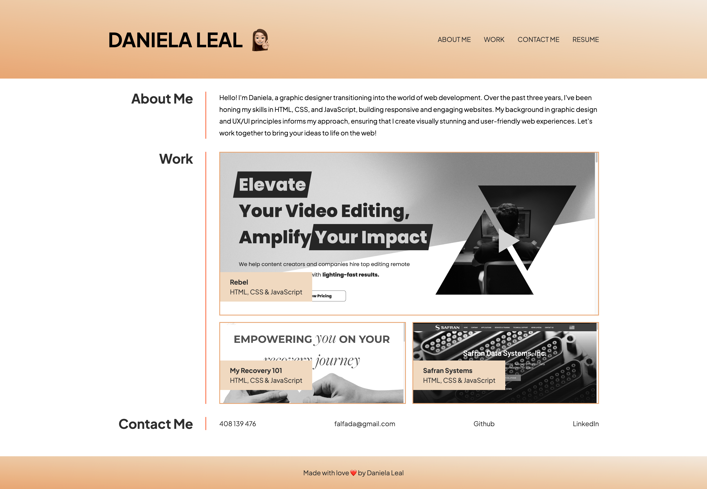

# Advanced CSS Challenge: Professional Portfolio

## Description
Professional portfolio with work samples, showcasing a responsive design crafted to adapt seamlessly to various screen sizes, ensuring a viewing experience across all devices through the use of HTML5 and CSS3 technologies

## Installation 
1. Clone the repository using the SSH key on your local machine with the command `git clone`, followed by the link provided by GitHub
2. Pull the project using the command `git pull`
3. Open the file index.html in your default browser.

## Usage
Open index.html in the default browser to view the website properly. It should resemble the image below.
  
  

## License
This portfolio is open-source and available under the MIT License.

